 # Medical oncept Annotation Tool Trainer
 
MedCATTrainer is an interface for building, improving and customising a given Named Entity Recognition 
and Linking (NER+L) model (MedCAT) for biomedical domain text.

MedCATTrainer was presented at EMNLP/IJCNLP 2019 :tada:
[here](https://www.aclweb.org/anthology/D19-3024.pdf)

# Table Of Contents
1. [Installation](#installation)
2. [Admin Setup](#admin-setup)
3. [User Guide](#user-guide)
    1. [Create An Annotation Project](#create-project)
        1. [Notes](#notes)
    2. [Annotation Interface](#anno-ui)
        1. [Section 1 - Document Summary List](#doc-summary)
        2. [Section 2 - Clinical Text](#main-text)
            1. [Additional Annotations](#add-annos)
        3. [Section 3 - Action Bar](#action-bar)
            1. [Concept Navigation Buttons](#concept-nav)
            2. [Concept Status Buttons](#concept-status)
            3. [Submit Button](#submit)
        4. [Section 4 - Header Toolbar](#header-tools)
        5. [Section 5 - Concept Summary](#concept-summary)
    3. [Meta-Annotations](#meta-annos)  
        1. [Meta Annotation Configuration](#meta-anno-config)
    4. [Project & Tool Administration](#project-tool-admin)
        1. [Configuring Concept Picker](#concept-picker-admin)
        2. [Downloading Annotations](#download-annos)
        3. [Cloning Projects](#clone-proj)
        4. [Resetting Projects](#reset-proj)
        5. [Save Models](#save-models)
        6. [Download Models](#download-models)
3. [Annotation Guidelines](#anno-guidelines)
4. [Advanced Usage](#advanced-usage)
        

# Installation 
MedCATtrainer is a docker-compose packaged Django application.

Quick-install script, downloads the docker-compose file, default env var and runs them.
1\. <pre>$ git clone https://github.com/CogStack/MedCATtrainer 
$ cd MedCATtrainer
$ docker-compose up</pre>

If you have MedCAT v0.x models, and want to use the trainer please use the following docker-compose file:
This refences the latest built image for the trainer that is still compatible with [MedCAT v0.x.](https://pypi.org/project/medcat/0.4.0.6/) and under. 
<pre>
$ docker-compose -f docker-compose-mc0x.yml up
</pre>

If the build fails with an error code 137, the virtual machine running the docker 
daemon does not have enough memory. Increase the allocated memory to containers in the docker daemon 
settings CLI or associated docker GUI.

On MAC: https://docs.docker.com/docker-for-mac/#memory

On Windows: https://docs.docker.com/docker-for-windows/#resources

2\. MedCATTrainer is now running:
- The main app is available at http://localhost:8001/
- The administrator (admin) app is available at http://localhost:8001/admin/

Upon initial install, an example administrator user, example dataset, concept database, vocab and project are setup. 
The next section provides further details.

3\. (Optional), Environment variables are used to configure the app:

|Parameter|Description|
|---------|-----------|
|MEDCAT_CONFIG_FILE|MedCAT config file as described [here](https://github.com/CogStack/MedCAT/blob/master/medcat/config.py)|
|BEHIND_RP| If you're running MedCATtrainer, use 1, otherwise this defaults to 0 i.e. False|
|MCTRAINER_PORT|The port to run the trainer app on|

Set these and re-run the docker-compose file.

You'll need to docker stop the running containers if you have already run the install.

# Administrator Setup
 
1\.  The container runs a vanilla [django](https://www.djangoproject.com/) app, that upon initially loaded
will create a defaulted administrator user with details:
 
 username: **admin**  
 password: **admin**

2\. We strongly recommend creating a new admin user before using the trainer in 'production' and storing sensitive
clinical documents on the trainer. To add a new user navigate to select http://localhost:8001/admin/ and select 'Users'.

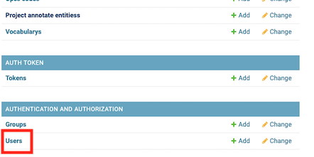

3\. Select 'Add User' and complete the form with a new username / password.

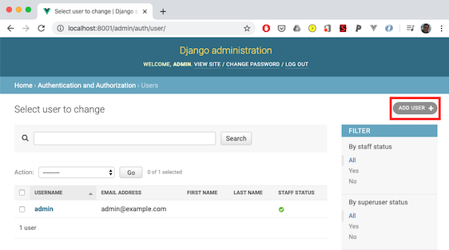

4\. Once created, select the new user, and tick the 'Staff Status' or 'Superuser Status' to allow the user to
access the admin app. 

5\. Remove the default admin user by navigating to step 2, select the user and the action  

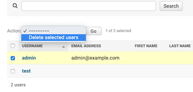

# User Guide 

## Demo
For demonstration purposes and general testing of a current model a stripped back version of the annotator is provided
via the 'Demo' tab of the main screen.

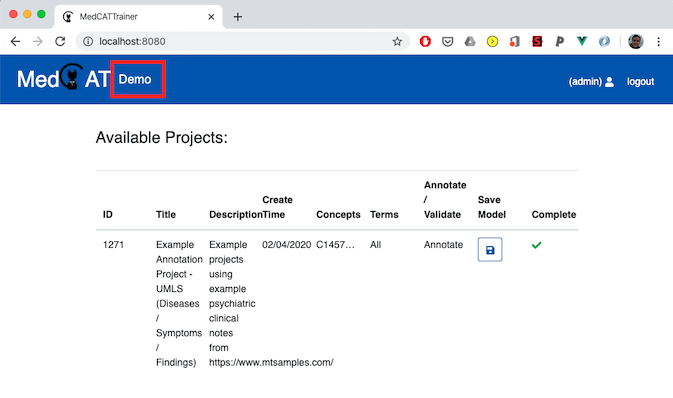

This presents a similar looking annotation screen as a real project, described in detail [here](#anno-ui), but does not 
force usage of a particular dataset, setup of filters, and other project settings. This view does not allow for 'annotating'
identified concepts (or adding new concepts) but allows for users to get a feel for what an existing MedCAT model is 
capable of annotating in via an interactive model

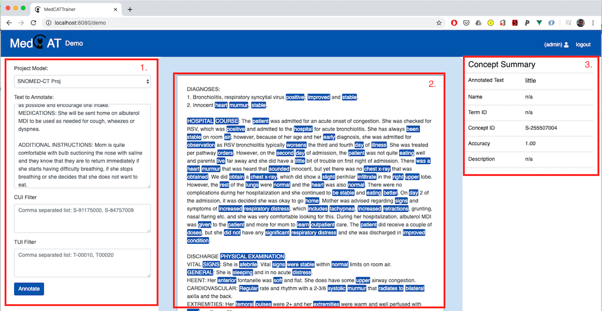

1\. A form to:
- Select the appropriate project model to view concept annotations for.
- Clinical text to annotate and display in 2.
- CUI and TUI filters can be used to only show concepts of interest in 2. For example for a UMLS CDB this could be
 T047 for "Disease or Syndrome". CUI and TUI filters are combined if entries are included in both form inputs.
 
2\. Example clinical text is displayed here, with text spans highlighted in blue. Click any annotation to show linked
concept DB details in 3.

3\. Linked concept details from selected concepts from the 2. 

## Create an Annotation Project 

Using the admin page, a configured superuser can create, edit and delete annotation projects.

Annotation projects are used to inspect, validate and improve concepts recognised by MedCAT.

1\. Navigate to http://localhost:8001/admin/ and select 'Project annotate entities'.

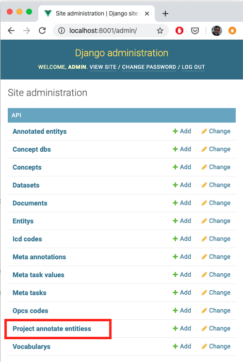

2\. 'Add Project Annotate Entities'

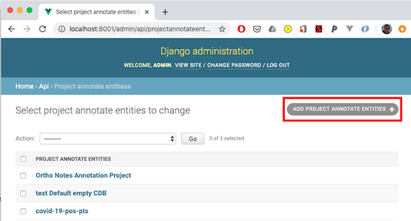

3\. Complete the new annotation project form. The table below provides details the purpose of each field:

|Parameter|Description|
|---------|-----------|
|Name|# Name of the project that appears on the landing page|
|Description| Example projects', # Description as it appears on the landing page|
|Members    | **list** of users that have access to this project, select the '+' to create new users |
|Dataset    | The set of documents to be annotated. The dataset tabular schema is described below.  |
|Validated Documents| Ignore this list. Use of this list is described in the forthcoming advanced administrator user guide|
|Cuis       | (Optional) A list of comma separated Concept Unique Identifiers (CUIs). Use this to only show precise concepts in this project |
|CUI File   | (Optional) A JSON formatted list of CUIs. Can be useful if the project should be setup to annotate large CUI lists extracted gathered from introspection of a CDB. **Will be merged with the above 'Cuis' list**| 
|Concept DB | A MedCAT Concept Database. This should be the resulting file from a call to the function medcat.cdb.CDB.save_dict('name_of_cdb.dat'). Clicking the '+' icon here opens a dialog to upload a CDB file. |
|vocab      | A MedCAT Vocabulary. This should be the resulting file from a call to the function medcat.cdb.utils.Vocab.save_dict('name_of_vocab.dat'). Clicking the '+' icon here opens a dialog to upload a vocab file.|
|cdb_search_filter|**list** of CDB IDs that are used to lookup concepts during addition of annotations to a document|
|Require Entity Validation| (Default: True) With this option ticked, annotations in the interface, that are made by MedCAT will appear 'grey' indicating they have not been validated. Document submission is dependent upon all 'grey' annotations to be marked by a user. Unticked ensures all annotations are marked 'valid' by default|
|Train Model On Submit| (Default: True) With this option ticked, each document submission trains the configured MedCAT instance with the marked, and added if any, annotations from this document. Unticked, ensures the MedCAT model does not train between submissions.| 
|Add New Entities|(Default: False) With this option ticked, allows users to add entirely new concepts to the existing MedCAT CDB. False ensures this option is not available to users.|
|Restrict Concept Lookup|(Default: False) With this option ticked, restricts the concept lookup (add annotation / alternative concept) to only include those CUIs listed in the above filters (either from CUI / TUI list or uploade 'CUI File' list|
|Terminate Available|(Default: True) With this option ticked, the option to terminate an annotated concept will appear|
|Irrelevant Available|(Default: False) With this option ticked, the option to mark an annotated concept as 'irrlevant' will appear|
|Tasks| Select from the list 'Meta Annotation' tasks that will appear once a given annotation has been marked correct.|

Datasets can be uploaded in CSV or XLSX format. Example:

| name  | text                   | 
|-------|------------------------|
| Doc 1 | Example document text  |
| Doc 2 | More example text      |

The name column is optional, and will be auto-generated for each document if not supplied in the upload. 
Example datasets are supplied under docs/example_data/*.csv

4\. Click 'Save' to store the new project.

5\. Navigate to the home screen (http://localhost:8001/admin/), login with your username and password setup previously.

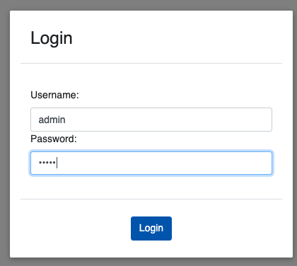

6\. select your new project to begin annotating documents

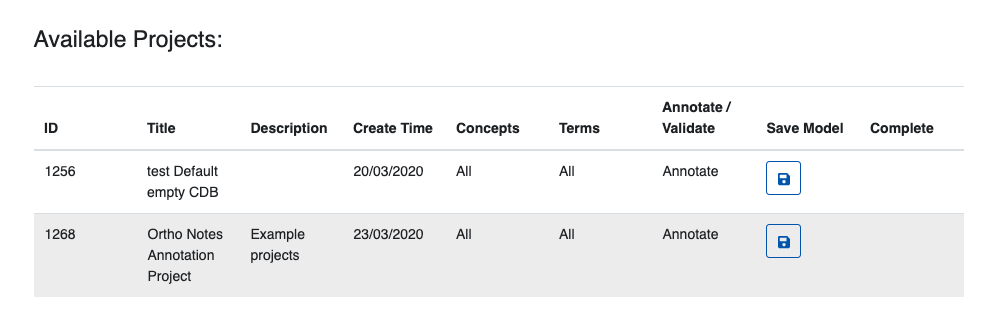

### Notes

**NB.** Example Concept and Vocab databses are freely available on MedCAT [github](https://github.com/CogStack/MedCAT).
Note. UMLS and SNOMED-CT are licensed products so only these smaller trained concept / vocab databases are made available currently.

More documentation on the creation of UMLS / SNOMED-CT CDBs from respective source data will be released soon.

**NNB.** Tasks allow for the creation of meta-annotations and their associated set of values an annotator can use.
An example 'meta-annotation' could be 'Temporality'. Values could then be 'Past', 'Present', 'Future'.

**NB** **Please NOTE Firefox and IE are currently not supported**. Please use Chrome or Safari.

## Annotation Interface 

The annotation interface can be split initially into 5 sections.

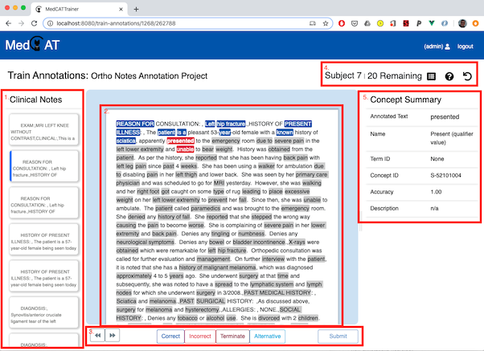

### Section 1 - Document Summary List 
A list of documents to be completed in this project. Currently selected documents are highlighted in blue 
left border. Submitted documents are marked with a . 

### Section 2 - Clinical Text
The selected documents text, highlighted with each concept recognised by the configured MedCAT model. 
Highlighted spans of text indicate status of the annotation:
- Grey: A User has *not reviewed* this span that has been recognised and linked by MedCAT to a CDB concept.
- Blue: A User has reviewed the span and marked it as ***correct*** in terms of its linked MedCAT concept.
- Red: A User has reviewed the span and marked it as **incorrect** in terms of its linked MedCAT concept.
- Dark Red: A User has reviewed the span and marked it to **terminate**, meaning the text span should never again 
link to this text span, this informs MedCAT that  
- Turqoise: A User has reviewed the span and marked it as an  **alternative** linked concept. The user has used the 
'Concept Picker' to choose the correct concept that should be linked.

#### Additional Annotations 
MedCAT may miss text spans that are acronyms, abbreviations or misspellings of concepts. Missing annotations can be 
added to the text by directly highlighting the text span, right clicking, selecting 'Add Annotation', searching for
 concept (via ID, or name), and selecting Add Synonym:
 
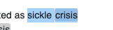 -> 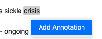 -> 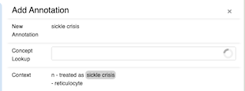 

Select: 
- Add Synonym: to add this anno§tation to the text span and link the selected concept
- Cancel: (Shortcut esc): to cancel adding the annotation to the text. 
 
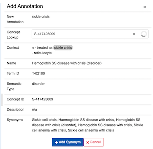
 

### Section 3 - Action Bar 

#### Concept Navigation 
Navigating between the list of concepts as they appear in the document:
- Action buttons, left and right 
- Left and right arrow keys on keyboard
- Directly clicking on the concept within the text.

#### Concept Status Buttons 
A concept can be marked with only one status. Status is recorded but only sent to MedCAT for
training on **submit** of the document and if the projects configured with "Train Model On Submit" is ticked.

#### Submit Button 
Submit is disabled until all concepts have been reviewed and marked with a status. Clicking submit will produce  
a submission confirmation dialog with an annotation summary. Confirming submission will send all new annotations 
to MedCATTrainer middle tier, and re-train the MedCAT model. The following document will be selected and annotated 
by the newly trained MedCAT model

### Section 4 - Header Toolbar 
Lists the current name of the document under review and the number of remaining documents to annotate in this project
action buttons for:
- : Summary of current annotations. f A similar view is shown before confirmation of submission of the annotations
- : Help dialog, showing shortcuts for document & concept navigation, concept annotation and submission.
- : Reset document. If an annotation is incorrectly added, or incorrectly submitted resetting the document will
clear all previous annotations and their status.

### Section 5 - Concept Summary 
Lists the current selected concepts details.

|Concept Detail| Description |
|--------------| ------------|
|Annotated Text| The text span linked to the concept|
|Name          | The linked concept name from within the MedCAT CDB|
|Term ID       | The higher level group of concepts that this concept sits under. This may be 'N/A' depending if you CDB is complete with TUIs.|
|Concept ID    | The unique identifier for this linked concept from the MedCAT CDB.|
|Accuracy      | The MedCAT found accuracy of the linked concept for this span. Text spans will have an accuracy 1.0, if they are uniquely identified by that name in the CDB|
|Description   | The MedCAT associated description of the concept. SNOMED-CT does not provide descriptions of concepts, only alternative names whereas UMLS does provide descriptions|

## Meta Annotations 

MedCAT is also able to learn project & context specific annotations that overlay on top of the base layer of concept annotations.

Example use cases of these annotations could be to train models to predict if:

- all disease concepts were **experienced** by the patient, a relative, or N/A.
- all symptom concepts are **temporally** reference present day, or are historical.
- all drug concepts are mentions of patients consuming drugs rather than **hypothetical** mentions.
- a complaint for a patient is **primary** or **secondary**.

MedCATTrainer is configurable (via the administrator app), to allow for the collection of these meta annotations. We 
currently have not integrated the active learning components of the concept recognition.  

#### Meta Annotation Configuration

To create a new Meta Annotation Task and attach to an existing project:

1\. Enter your project configuration settings via the admin page (http://localhost:8001/admin/)
 
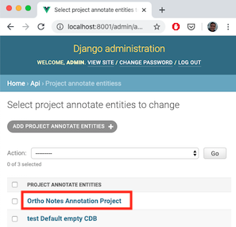

2\. At the bottom of the form, select the + icon to bring up the new Meta Annotation Task Form.

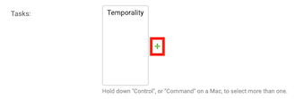

3\. Complete the form and add additional meta task values if required for your task via the '+' icon and the 'values' input. 
Values are enumerated options for your specific task. These can be re-used across projects or be project specific.
Ensure the default is one of the corresponding values available. Descriptions appear alongside the tasks in interface 
and in full in the help dialog.
 

4\. Select desired Meta Annotation tasks for the project by holding down (ctrl / cmd) and clicking the meta tasks, 
then select 'Save' to save the project changes.

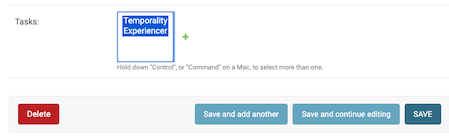

5\. Meta Annotations now appear in the interface for that project under the concept summary. Meta-annotations 
only appear for concepts that are correct.

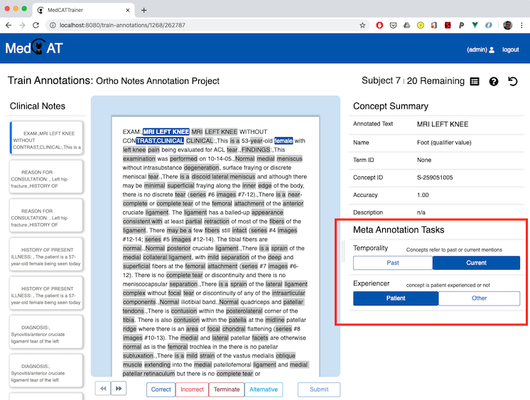

## Project / Tool Administration

### Concept Picker - CDB Concept Import

The concept picker is used to:
- Pick alternative concepts for an existing recognised span
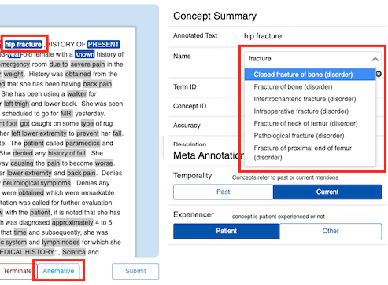
- Pick a concept during the 'Add Annotation' process.
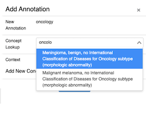

The available list of concepts is populated via a MedCAT CDB and indexed to enable fast type-ahead style search. 

SNOMED-CT / UMLS built databases can contain thousands if not millions of concepts so this process is executed 
in asynchronous task to ensure the admin page and app are still available for use.

**This process should only be done once for each concept universe (i.e. SNOMED-CT, UMLS are 2 distinct concept universes)** 
per deployment or if the underlying MedCAT CDB changes Concepts will be indexed by there CUI, so importing different 
CDB instances that reference the same concept universe will only import
the concepts that are in the set difference.

To make these concepts available to a (or any project):

1\. Open the admin app. (http://localhost:8001/admin/)

2\. Select 'Concept Dbs'

3\. Select the Concept DB entry, and choose the action 'Import Concept', then press the 'Go' button.
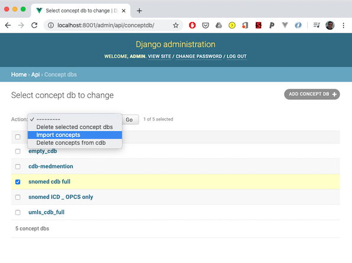

### Downloading Annotations
Project annotations can be downloaded with or without the source text, especially important if the source text is
particularly sensitive and should be not be shared.

1\. Open the admin app. (http://localhost:8001/admin/)

2\. Select 'Project annotate entities', 

3\. Select the project(s) to download the annotations for and select the appropriate action for w/ or w/o source text, 
then press the 'Go' button. This will download all annotations, the meta-annotations (if any) for all projects selected.
Annotations

4\. An example jupyter notebook is provided under docs/Processing_Annotations.ipynb. 

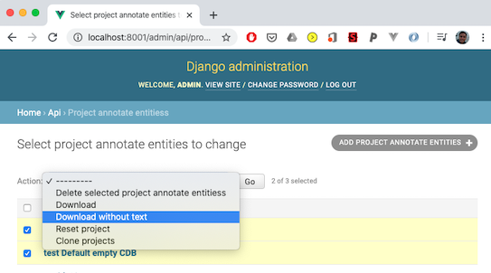

### Clone Project 
Cloning Projects is a easy & fast method to create copies of configured projects. This includes the dataset, CDB / vocab
reference, meta annotation settings etc. Annotations themselves will not be copied across.

1\. Open the admin app. (http://localhost:8001/admin/), and select 'Project annotate entities' (same as above for downloading)

2\. Select the project(s) to clone, select the 'Clone projects', then press the 'Go' button.
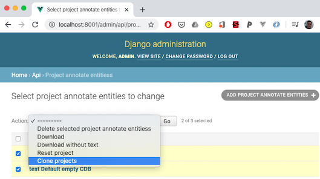

NB: Cloning projects will use the same CDB instance. If you're double annotating datasets to then calculate agreement scores (IIA, Cohen's Kappa etc.)
then uncheck "Train Model On Submit" for each of the projects to ensure the model is not trained by each annotator. 
If you do want 'online training' of the model, use separate instances of the same model. You can directly upload multiple 
instances of the same CDB file appropriately named to achieve this.

### Reset Project
**Use with caution. Resetting projects deletes all annotations and resets a project to its state upon initial creation.** 

1\. Open the admin app. (http://localhost:8001/admin/), and select 'Project annotate entities'
(same as above for downloading)

2\. Select the project(s) to reset, then press the 'Go' button.
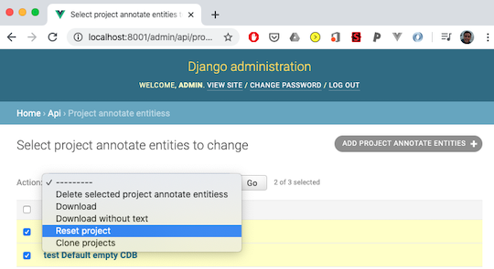

### Save Models
We strongly suggest models are not saved within MedCATtrainer then directly used. Instead, we suggest you use the collected
annotations from projects to train and test a new MedCAT model.

However, to save the current state of the model you can use:
 
An API call - \<deployment\>:\<port\>/save-models/<project-id> that can be used to save the current state of
a model. This will overwrite the current CDB file. 

Alternatively, login with an 'admin', (i.e. staff or superuser) account and hit the save model button associated with the project.

### Download Models

1\. Open the admin app. (http://localhost:8001/admin/), and select 'Concept dbs'.

2\. Click the CDB item you would like to download.

4\. Click the CDB file, you will be prompted to save down the new CDB file. This file will be of the same format you 
have used previously, i.e. you've called medcat.cdb.save_dict('<location>').

The saved MedCAT models can be used in any instance a regular MedCAT model may be used. I.e. in a jupyter notebook, 
part of a web service, or further fine-tuning in another MedCATTrainer instance. 

The Trainer currently does not support inspection / training / storage of the meta annotation models. These will be
integrated in a forthcoming release.

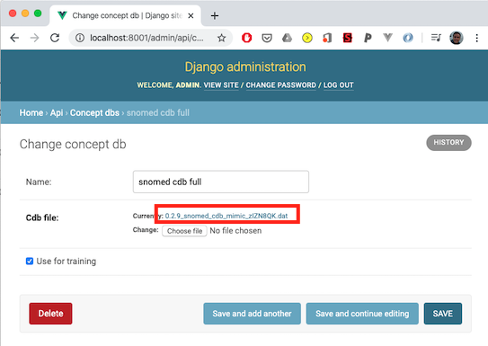

5\. To load the new dictionary use medcat.cdb.load_dict('<location>')

# Annotation Guidelines
Annotation guidelines can assist guiding annotators when annotating texts for a MedCATTrainer project.
 
Once an initial guideline has been defined, a pilot project in MedCATTrainer can be used to further 
refine the guideline.

# Advanced Usage

- ReST API Usage for bulk dataset / project creation: available in: docs/API_Examples.ipynb 

