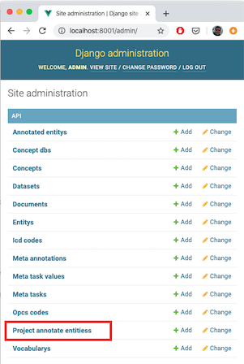
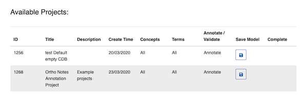

 # Medical oncept Annotation Tool Trainer
 
MedCATTrainer is an interface for building, improving and customising a given Named Entity Recognition and Linking (NER+L) model for biomedical domain text

MedCATTrainer was presented at EMNLP/IJCNLP 2019 :tada:
[here](https://www.aclweb.org/anthology/D19-3024.pdf) 

# Installation
 
1\. Clone the repo:

`$ git clone https://github.com/CogStack/MedCATtrainer.git`

2\.  Build and run the docker image

`$ cd MedCATTrainer`

`$ docker-compose -f docker-compose-dev.yml build`

If the build fails with an error code 137, the virtual machine running the docker 
daemon does not have enough memory. Increase the allocated memory to containers in the docker daemon settings CLI or associated docker GUI.

`$ docker-compose -f docker-compose-dev.yml up`

3\. MedCATTrainer is now running:
- The app is at http://localhost:8001/
- The administrator (admin) app is at http://localhost:8001/admin/

A username / password permissions the data / models that are setup via the administrator app. 
An initial super user must be setup to login to login to admin. 

# Administrator Setup

1\.  The container runs a vanilla [django](https://www.djangoproject.com/) app, 
that by default has no users (or super users). To add the first superuser use the django manage.py 
createsuperuser function within the runnning container. **Further users, (i.e. annotators for 
a given project) can be added via the django admin UI.**

   1\. First get the running container name:
`$ docker ps`

> CONTAINER ID        IMAGE                      COMMAND                  CREATED             STATUS              PORTS                            NAMES
> 62b9a2380f30        medcattrainer_nginx           "nginx -g 'daemon of…"   2 days ago          Up 2 days           80/tcp, 0.0.0.0:8001->8000/tcp   medcattrainer_nginx_1
> 93168cc98c15        medcattrainer_medcattrainer   "/home/run.sh"           2 days ago          Up 2 days           8000/tcp                         **medcattrainer_medcattrainer_1**

  2\. Login to the container running django. (The 2nd entry of the output of the ps, as indicated in **bold**).

`docker exec -it cattrainer_medcattrainer_1 bash`

> root@93168cc98c15:/home/api# 

  3\. Create the superuser username and password by following the prompts.

`root@93168cc98c15:/home/api# python manage.py createsuperuser`

> Username (leave blank to use 'root'): 
> Email address: 
> Password: 
> Password (again): 
> The password is too similar to the username.
> This password is too short. It must contain at least 8 characters.
> This password is too common.
> Bypass password validation and create user anyway? [y/N]: y
> Superuser created successfully.

  4\. You can now login to the main and admin app with the newly created user.

  5\. To upload documents and begin annotating, you'll first need to create a project via the admin page: 
http://localhost:8001/admin/.

# User Guide

## Create an Annotation Project

Using the admin page, a configured superuser can create, edit and delete annotation projects.

Annotation projects are used to inspect, validate and improve concepts recognised by MedCAT.

1\. Navigate to http://localhost:8001/admin/ and select 'Project annotate entities'.

2\. 'Add Project Annotate Entities'

3\. Complete the new annotation project form. The table below provides details the purpose of each field:

|Parameter|Description|
|---------|-----------|
|Name|# Name of the project that appears on the landing page|
|Description| Example projects', # Description as it appears on the landing page|
|Members    | **list** of users that have access to this project, select the '+' to create new users |
|Dataset    | The set of documents to be annotated. The dataset tabular schema is described below.  |
|Validated Documents| Ignore this list. Use of this list is described in the forthcoming advanced administrator user guide|
|Cuis       | (Optional) A list of comma separated Concept Unique Identifiers (CUIs). Use this to only show precise concepts in this project |
|Tuis       | (Optional) A list of comma separated Term Unique Identifiers (TUIs). Use this to only show groups of CUIs as configured in your CDB. TUIs are logical groupings of CUIs such as 'disease', or 'symptom'|
|Concept DB | A MedCAT Concept Database. This should be the resulting file from a call to the function medcat.cdb.CDB.save_dict('name_of_cdb.dat'). Clicking the '+' icon here opens a dialog to upload a CDB file. |
|vocab      | A MedCAT Vocabulary. This should be the resulting file from a call to the function medcat.cdb.utils.Vocab.save_dict('name_of_vocab.dat'). Clicking the '+' icon here opens a dialog to upload a vocab file.|
|cdb_search_filter|**list** of CDB IDs that are used to lookup concepts during addition of annotations to a document|
|Require Entity Validation| (Default: True) This option ticked, annotations in the interface, that are made by MedCAT will appear 'grey' indicating they have not been validated. Document submission is dependent upon all 'grey' annotations to be marked by a user. Unticked ensures all annotations are marked 'valid' by default|
|Train Model On Submit| (Default: True) This option ticked, each document submission trains the configured MedCAT instance with the marked, and added if any, annotations from this document. Unticked, ensures the MedCAT model does not train between submissions.|
|Clinical Coding Project| (Default: False) This option ticked, is an experimental feature, tailoring interface to the problem of clinical coding| 
|Add New Entities|(Default: False) This option ticked, allows users to add entirely new concepts to the existing MedCAT CDB. False ensures this option is not available to users.|
|Tasks| Select from the list 'Meta Annotation' tasks that will appear once a givn annotation has been marked correct.|

Datasets can be uploaded in CSV or XLSX format. Example:

| name  | text                   | 
|-------|------------------------|
| Doc 1 | Example document text  |
| Doc 2 | More example text      |

The name column is optional, and will be auto-generated for each document if not supplied in the upload. Example datasets are supplied under docs/example_data/*.csv

4\. Click 'Save' to store the new project.

5\. Navigate to the home screen (http://localhost:8001/admin/), login with your username and password setup previously.

 

6\. select your new project to begin annotating documents

 

**NB.** Example Concept and Vocab databses are freely available on MedCAT [github](https://github.com/CogStack/MedCAT).
Note. UMLS and SNOMED-CT are licensed products so only these smaller trained concept / vocab databases are made available currently.

More documentation on the creation of UMLS / SNOMED-CT CDBs from respective source data will be released soon.

**NNB.** Tasks allow for the creation of meta-annotations and their associated set of values an annotator can use.
An example 'meta-annotation' could be 'Temporality'. Values could then be 'Past', 'Present', 'Future'.

**NB*** **Please NOTE Firefox and IE are currently not supported**. Please use Chrome or Safari.

## Annotation Interface

## Annotation Guidelines

Annotation guidelines can assit guiding annotators when annotatinng texts for a MedCATTrainer project.
 
Once an initial guideline has been defined, a pilot project in MedCATTrainer can be used to further 
refine the guideline.

## Advanced Usage

ReST API Usage for bulk dataset / project creation
Bulk Creation Programmatic 

