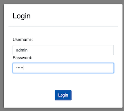
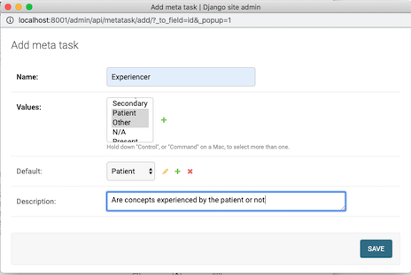
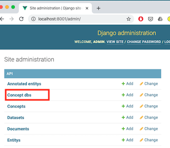

 # Medical oncept Annotation Tool Trainer
 
MedCATTrainer is an interface for building, improving and customising a given Named Entity Recognition 
and Linking (NER+L) model for biomedical domain text

MedCATTrainer was presented at EMNLP/IJCNLP 2019 :tada:
[here](https://www.aclweb.org/anthology/D19-3024.pdf) 

# Installation
 
1\. Clone the repo:

`$ git clone https://github.com/CogStack/MedCATtrainer.git`

2\.  Build and run the docker image

`$ cd MedCATTrainer`

`$ docker-compose -f docker-compose-dev.yml build`

If the build fails with an error code 137, the virtual machine running the docker 
daemon does not have enough memory. Increase the allocated memory to containers in the docker daemon 
settings CLI or associated docker GUI.

On MAC: https://docs.docker.com/docker-for-mac/#memory

On Windows: https://docs.docker.com/docker-for-windows/#resources 

Then run:

`$ docker-compose -f docker-compose-dev.yml up`

3\. MedCATTrainer is now running:
- The app is at http://localhost:8001/
- The administrator (admin) app is at http://localhost:8001/admin/

A username / password permissions the data / models that are setup via the administrator app. 
An initial super user must be setup to login to login to admin. 

# Administrator Setup

1\.  The container runs a vanilla [django](https://www.djangoproject.com/) app, 
that by default has no users (or super users). To add the first superuser use the django manage.py 
createsuperuser function within the runnning container. **Further users, (i.e. annotators for 
a given project) can be added via the django admin UI.**

   1\. First get the running container name:
`$ docker ps`

> CONTAINER ID        IMAGE                      COMMAND                  CREATED             STATUS              PORTS                            NAMES
> 62b9a2380f30        medcattrainer_nginx           "nginx -g 'daemon of…"   2 days ago          Up 2 days           80/tcp, 0.0.0.0:8001->8000/tcp   medcattrainer_nginx_1
> 93168cc98c15        medcattrainer_medcattrainer   "/home/run.sh"           2 days ago          Up 2 days           8000/tcp                         **medcattrainer_medcattrainer_1**

  2\. Login to the container running django. (The 2nd entry of the output of the ps, as indicated in **bold**).

`docker exec -it cattrainer_medcattrainer_1 bash`

> root@93168cc98c15:/home/api# 

  3\. Create the superuser username and password by following the prompts.

`root@93168cc98c15:/home/api# python manage.py createsuperuser`

> Username (leave blank to use 'root'): 
> Email address: 
> Password: 
> Password (again): 
> The password is too similar to the username.
> This password is too short. It must contain at least 8 characters.
> This password is too common.
> Bypass password validation and create user anyway? [y/N]: y
> Superuser created successfully.

  4\. You can now login to the main and admin app with the newly created user.

  5\. To upload documents and begin annotating, you'll first need to create a project via the admin page: 
http://localhost:8001/admin/.

# User Guide

## Create an Annotation Project

Using the admin page, a configured superuser can create, edit and delete annotation projects.

Annotation projects are used to inspect, validate and improve concepts recognised by MedCAT.

1\. Navigate to http://localhost:8001/admin/ and select 'Project annotate entities'.

2\. 'Add Project Annotate Entities'

3\. Complete the new annotation project form. The table below provides details the purpose of each field:

|Parameter|Description|
|---------|-----------|
|Name|# Name of the project that appears on the landing page|
|Description| Example projects', # Description as it appears on the landing page|
|Members    | **list** of users that have access to this project, select the '+' to create new users |
|Dataset    | The set of documents to be annotated. The dataset tabular schema is described below.  |
|Validated Documents| Ignore this list. Use of this list is described in the forthcoming advanced administrator user guide|
|Cuis       | (Optional) A list of comma separated Concept Unique Identifiers (CUIs). Use this to only show precise concepts in this project |
|Tuis       | (Optional) A list of comma separated Term Unique Identifiers (TUIs). Use this to only show groups of CUIs as configured in your CDB. TUIs are logical groupings of CUIs such as 'disease', or 'symptom'|
|Concept DB | A MedCAT Concept Database. This should be the resulting file from a call to the function medcat.cdb.CDB.save_dict('name_of_cdb.dat'). Clicking the '+' icon here opens a dialog to upload a CDB file. |
|vocab      | A MedCAT Vocabulary. This should be the resulting file from a call to the function medcat.cdb.utils.Vocab.save_dict('name_of_vocab.dat'). Clicking the '+' icon here opens a dialog to upload a vocab file.|
|cdb_search_filter|**list** of CDB IDs that are used to lookup concepts during addition of annotations to a document|
|Require Entity Validation| (Default: True) This option ticked, annotations in the interface, that are made by MedCAT will appear 'grey' indicating they have not been validated. Document submission is dependent upon all 'grey' annotations to be marked by a user. Unticked ensures all annotations are marked 'valid' by default|
|Train Model On Submit| (Default: True) This option ticked, each document submission trains the configured MedCAT instance with the marked, and added if any, annotations from this document. Unticked, ensures the MedCAT model does not train between submissions.|
|Clinical Coding Project| (Default: False) This option ticked, is an experimental feature, tailoring interface to the problem of clinical coding| 
|Add New Entities|(Default: False) This option ticked, allows users to add entirely new concepts to the existing MedCAT CDB. False ensures this option is not available to users.|
|Tasks| Select from the list 'Meta Annotation' tasks that will appear once a givn annotation has been marked correct.|

Datasets can be uploaded in CSV or XLSX format. Example:

| name  | text                   | 
|-------|------------------------|
| Doc 1 | Example document text  |
| Doc 2 | More example text      |

The name column is optional, and will be auto-generated for each document if not supplied in the upload. 
Example datasets are supplied under docs/example_data/*.csv

4\. Click 'Save' to store the new project.

5\. Navigate to the home screen (http://localhost:8001/admin/), login with your username and password setup previously.

6\. select your new project to begin annotating documents

 
## Meta Annotations (Optional)

Meta Annotations are additional annotations above the initial concept annotation. An example of meta annotation is temporality.  

**NB.** Example Concept and Vocab databses are freely available on MedCAT [github](https://github.com/CogStack/MedCAT).
Note. UMLS and SNOMED-CT are licensed products so only these smaller trained concept / vocab databases are made available currently.

More documentation on the creation of UMLS / SNOMED-CT CDBs from respective source data will be released soon.

**NNB.** Tasks allow for the creation of meta-annotations and their associated set of values an annotator can use.
An example 'meta-annotation' could be 'Temporality'. Values could then be 'Past', 'Present', 'Future'.

**NB** **Please NOTE Firefox and IE are currently not supported**. Please use Chrome or Safari.

## Annotation Interface

The annotation interface can be split initially into 5 sections.

### Section 1 - Document Summary List
A list of documents to be completed in this project. Currently selected documents are highlighted in blue 
left border. Submitted documents are marked with a . 

### Section 2 - Clinical Text
The selected documents text, highlighted with each concept recognised by the configured MedCAT model. 
Highlighted spans of text indicate status of the annotation:
- Grey: A User has *not reviewed* this span that has been recognised and linked by MedCAT to a CDB concept.
- Blue: A User has reviewed the span and marked it as ***correct*** in terms of its linked MedCAT concept.
- Red: A User has reviewed the span and marked it as **incorrect** in terms of its linked MedCAT concept.
- Dark Red: A User has reviewed the span and marked it to **terminate**, meaning the text span should never again 
link to this text span, this informs MedCAT that  
- Turqoise: A User has reviewed the span and marked it as an  **alternative** linked concept. The user has used the 
'Concept Picker' to choose the correct concept that should be linked.

#### Additional Annotations
MedCAT may miss text spans that are acronyms, abbreviations or misspellings of concepts. Missing annotations can be 
added to the text by directly highlighting the text span, right clicking, selecting 'Add Annotation', searching for
 concept (via ID, or name), and selecting Add Synonym:
 
 ->  ->  

Select: 
- Add Synonym: to add this annotation to the text span and link the selected concept
- Cancel: (Shortcut esc): to cancel adding the annotation to the text. 
 

 
### Section 3 - Action Bar

#### Concept Navigation
Navigating between the list of concepts as they appear in the document:
- Action buttons, left and right 
- Left and right arrow keys on keyboard
- Directly clicking on the concept within the text.

#### Concept Status Buttons
A concept can be marked with only one status. Status is recorded but only sent to MedCAT for
training on **submit** of the document and if the projects configured with "Train Model On Submit" is ticked.

#### Submit Button
Submit is disabled until all concepts have been reviewed and marked with a status. Clicking submit will produce  
a submission confirmation dialog with an annotation summary. Confirming submission will send all new annotations 
to MedCATTrainer middle tier, and re-train the MedCAT model. The following document will be selected and annotated 
by the newly trained MedCAT model

### Section 4 - Header Toolbar
Lists the current name of the document under review and the number of remaining documents to annotate in this project
action buttons for:
- : Summary of current annotations. A similar view is shown before confirmation of submission of the annotations
- : Help dialog, showing shortcuts for document & concept navigation, concept annotation and submission.
- : Reset document. If an annotation is incorrectly added, or incorrectly submitted resetting the document will
clear all previous annotations and their status.

 ### Section 5 - Concept Summary
Lists the current selected concepts details.

|Concept Detail| Description |
|--------------| ------------|
|Annotated Text| The text span linked to the concept|
|Name          | The linked concept name from within the MedCAT CDB|
|Term ID       | The higher level group of concepts that this concept sits under. This may be 'N/A' depending if you CDB is complete with TUIs.|
|Concept ID    | The unique identifier for this linked concept from the MedCAT CDB.|
|Accuracy      | The MedCAT found accuracy of the linked concept for this span. Text spans will have an accuracy 1.0, if they are uniquely identified by that name in the CDB|
|Description   | The MedCAT associated description of the concept. SNOMED-CT does not provide descriptions of concepts, only alternative names whereas UMLS does provide descriptions|

### Meta Annotations

MedCAT is also able to learn project & context specific annotations that overlay on top of the base layer of concept annotations.

Example use cases of these annotations could be to train models to predict if:

- all disease concepts were **experienced** by the patient, a relative, or N/A.
- all symptom concepts are **temporally** reference present day, or are historical.
- all drug concepts are mentions of patients consuming drugs rather than **hypothetical** mentions.
- a complaint for a patient is **primary** or **secondary**.

MedCATTrainer is configurable (via the administrator app), to allow for the collection of these meta annotations. We 
currently have not integrated the active learning components of the concept recognition.  

#### Meta Annotation Configuration

To create a new Meta Annotation Task and attach to an existing project:

1\. Enter your project configuration settings via the admin page (http://localhost:8001/admin/)
 

2\. At the bottom of the form, select the + icon to bring up the new Meta Annotation Task Form.

3\. Complete the form and add additional meta task values if required for your task via the '+' icon and the 'values' input. 
Values are enumerated options for your specific task. These can be re-used across projects or be project specific.
Ensure the default is one of the corresponding values available. Descriptions appear alongside the tasks in interface 
and in full in the help dialog.
 

4\. Select desired Meta Annotation tasks for the project by holding down (ctrl / cmd) and clicking the meta tasks, 
then select 'Save' to save the project changes.

5\. Meta Annotations now appear in the interface for that project under the concept summary. Meta-annotations 
only appear for concepts that are correct.

### Project / Tool Administration

#### Concept Picker - CDB Concept Import

The concept picker is used to:
- Pick alternative concepts for an existing recognised span

- Pick a concept during the 'Add Annotation' process.

The available list of concepts is populated via a MedCAT CDB and indexed to enable fast type-ahead style search. 

SNOMED-CT / UMLS built databases can contain thousands if not millions of concepts so this process is executed 
in asynchronous task to ensure the admin page and app are still available for use.

**This process should only be done once for each concept universe (i.e. SNOMED-CT, UMLS are 2 distinct concept universes)** 
per deployment or if the underlying MedCAT CDB changes Concepts will be indexed by there CUI, so importing different 
CDB instances that reference the same concept universe will only import
the concepts that are in the set difference.

To make these concepts available to a (or any project):

1\. Open the admin app. (http://localhost:8001/admin/)

2\. Select 'Concept Dbs'

3\. Select the Concept DB entry, and choose the action 'Import Concept', then press the 'Go' button.

#### Downloading Annotations
Project annotations can be downloaded with or without the source text, especially important if the source text is
particularly sensitive and should be not be shared.

1\. Open the admin app. (http://localhost:8001/admin/)

2\. Select 'Project annotate entities', 

3\. Select the project(s) to download the annotations for and select the appropriate action for w/ or w/o source text, 
then press the 'Go' button. This will download all annotations, the meta-annotations (if any) for all projects selected.
Annotations

4\. An example jupyter notebook is provided under docs/Processing_Annotations.ipynb. 

#### Clone Project 
Cloning Projects is a easy & fast method to create copies of configured projects. This includes the dataset, CDB / vocab
reference, meta annotation settings etc. Annotations themselves will not be copied across.
copied across.

1\. Open the admin app. (http://localhost:8001/admin/), and select 'Project annotate entities' (same as above for downloading)

2\. Select the project(s) to clone, select the 'Clone projects', then press the 'Go' button.

#### Reset Project
**Use with caution. Resetting projects deletes all annotations and resets a project to its state upon initial creation.** 

1\. Open the admin app. (http://localhost:8001/admin/), and select 'Project annotate entities'
(same as above for downloading)

2\. Select the project(s) to reset, then press the 'Go' button.

#### Save / Download Models
Saving a model, takes the current state of the CDB is currently loaded in memory of the container and overwrites to the
associated CDB file originally uploaded. To save and download a model for further use in a MedCAT instance:
 
1\. Select the 'Save' model icon on the home page of that project. If the same CDB is used across multiple projects, you 
only need to save once across all projects. Wait for the confirmation dialog for successfull saving of models to appear.  

2\. Open the admin app. (http://localhost:8001/admin/), and select 'Concept dbs'.

3\. Click the CDB item you would like to download.

4\. Click the CDB file, you will be prompted to save down the new CDB file. This file will be of the same format you 
have used previously, i.e. you've called medcat.cdb.save_dict('<location>').

5\. To load the new dictionary use medcat.cdb.load_dict('<location>')

## Annotation Guidelines
Annotation guidelines can assist guiding annotators when annotating texts for a MedCATTrainer project.
 
Once an initial guideline has been defined, a pilot project in MedCATTrainer can be used to further 
refine the guideline.

## Advanced Usage

- ReST API Usage for bulk dataset / project creation: available in the jupyter notebook 

