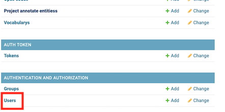
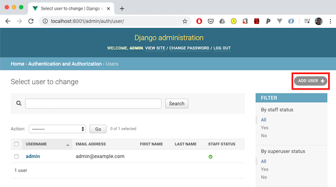
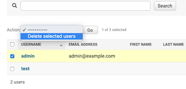

# Administrator Setup

1\.  The container runs a vanilla [django](https://www.djangoproject.com/) app, that upon initially loaded
will create a defaulted administrator user with details:

    username: **admin**
    password: **admin**

2\. We strongly recommend creating a new admin user before using the trainer in 'production' and storing sensitive
clinical documents on the trainer. To add a new user navigate to select `http://localhost:8001/admin/` and select 'Users'.

3\. Select 'Add User' and complete the form with a new username / password.

4\. Once created, select the new user, and tick the 'Staff Status' or 'Superuser Status' to allow the user to
access the admin app.

5\. Remove the default admin user by navigating to step 2, select the user and the action

