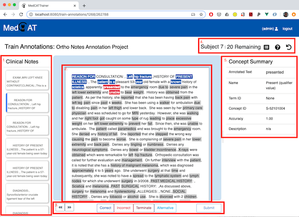
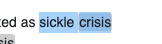
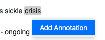
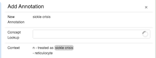
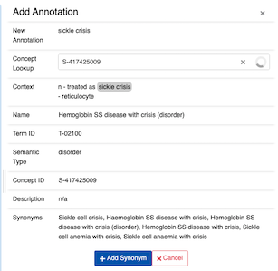

# Annotation Interface

The annotation interface can be split into 5 sections.

## Section 1 - Document Summary List
A list of documents to be completed in this project. Currently selected documents are highlighted in blue
left border. Submitted documents are marked with a .

## Section 2 - Clinical Text
The selected documents text, highlighted with each concept recognised by the configured MedCAT model.
Highlighted spans of text indicate status of the annotation:
- Grey: A User has *not reviewed* this span that has been recognised and linked by MedCAT to a CDB concept.
- Blue: A User has reviewed the span and marked it as ***correct*** in terms of its linked MedCAT concept.
- Red: A User has reviewed the span and marked it as **incorrect** in terms of its linked MedCAT concept.
- Dark Red: A User has reviewed the span and marked it to **terminate**, meaning the text span should never again
  link to this text span, this informs MedCAT that
- Turqoise: A User has reviewed the span and marked it as an  **alternative** linked concept. The user has used the
  'Concept Picker' to choose the correct concept that should be linked.

### Additional Annotations
MedCAT may miss text spans that are acronyms, abbreviations or misspellings of concepts. Missing annotations can be
added to the text by directly highlighting the text span, right clicking, selecting 'Add Term', searching for
concept (via ID, or name), and selecting Add Term:

 ->  -> 

Select:
- Add Term: to add this annotation to the text span and link the selected concept
- Cancel: (Shortcut esc): to cancel adding the annotation to the text.

## Section 3 - Action Bar

### Concept Navigation
Navigating between the list of concepts as they appear in the document:
- Action buttons, left and right
- Left and right arrow keys on keyboard
- Directly clicking on the concept within the text.

### Concept Status Buttons
A concept can be marked with only one status. Status is recorded but only sent to MedCAT for
training on **submit** of the document and if the projects configured with "Train Model On Submit" is ticked.

### Submit Button
Submit is disabled until all concepts have been reviewed and marked with a status. Clicking submit will produce  
a submission confirmation dialog with an annotation summary. Confirming submission will send all new annotations
to MedCATTrainer middle tier, and re-train the MedCAT model. The following document will be selected and annotated
by the newly trained MedCAT model

## Section 4 - Header Toolbar
Lists the current name of the document under review and the number of remaining documents to annotate in this project
action buttons for:
- : Summary of current annotations. f A similar view is shown before confirmation of submission of the annotations
- : Help dialog, showing shortcuts for document & concept navigation, concept annotation and submission.
- : Reset document. If an annotation is incorrectly added, or incorrectly submitted resetting the document will
  clear all previous annotations and their status.

## Section 5 - Concept Summary
Lists the current selected concepts details.

|Concept Detail| Description |
|--------------| ------------|
|Annotated Text| The text span linked to the concept|
|Name          | The linked concept name from within the MedCAT CDB|
|Type ID       | The higher level group of concepts that this concept sits under. This may be 'N/A' depending if your CDB has Type IDs or not.|
|Concept ID    | The unique identifier for this linked concept from the MedCAT CDB.|
|Accuracy      | The MedCAT found accuracy of the linked concept for this span. Text spans will have an accuracy 1.0, if they are uniquely identified by that name in the CDB|
|Description   | The MedCAT associated description of the concept. SNOMED-CT does not provide descriptions of concepts, only alternative names whereas UMLS does provide descriptions|