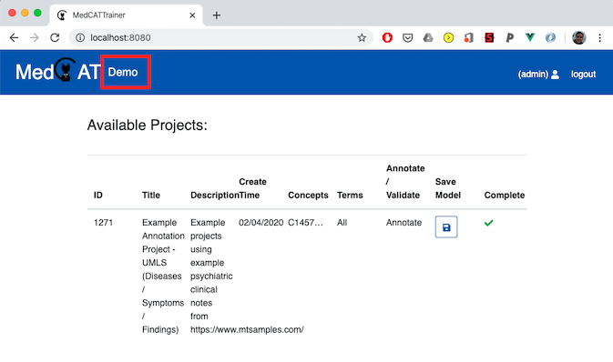
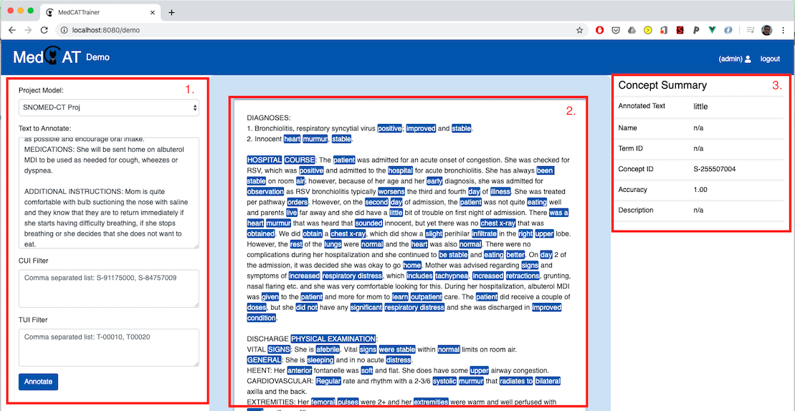

# Demo
For demonstration purposes and general testing of a current model a stripped back version of the annotator is provided
via the 'Demo' tab of the main screen.

This presents a similar looking annotation screen as a real project, but does not
force usage of a particular dataset, setup of filters, and other project settings. This view does not allow for 'annotating'
identified concepts (or adding new concepts) but allows for users to get a feel for what an existing MedCAT model is
capable of annotating in via an interactive model

1\. A form to:
- Select the appropriate project model to view concept annotations for.
- Clinical text to annotate and display in 2.
- CUI and TypeID filters can be used to only show concepts of interest in 2. For example for a UMLS CDB this could be
  T047 for "Disease or Syndrome". CUI and TypeID filters are combined if entries are included in both form inputs.

2\. Example clinical text is displayed here, with text spans highlighted in blue. Click any annotation to show linked
concept DB details in 3.

3\. Linked concept details from selected concepts from the 2. 