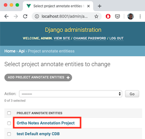
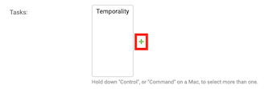
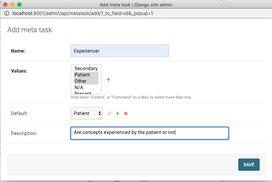
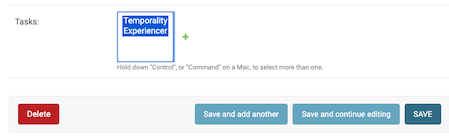
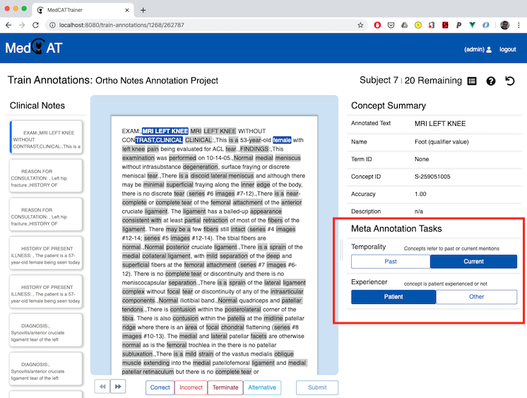

# Meta Annotations

MedCAT is also able to learn project & context specific annotations that overlay on top of the base layer of concept annotations.

Example use cases of these annotations could be to train models to predict if:

- all disease concepts were **experienced** by the patient, a relative, or N/A.
- all symptom concepts are **temporally** reference present day, or are historical.
- all drug concepts are mentions of patients consuming drugs rather than **hypothetical** mentions.
- a complaint for a patient is **primary** or **secondary**.

MedCATTrainer is configurable (via the administrator app), to allow for the collection of these meta annotations. We
currently have not integrated the active learning components of the concept recognition.

## Meta Annotation Configuration

To create a new Meta Annotation Task and attach to an existing project:

1\. Enter your project configuration settings via the admin page (http://localhost:8001/admin/)

2\. At the bottom of the form, select the + icon to bring up the new Meta Annotation Task Form.

3\. Complete the form and add additional meta task values if required for your task via the '+' icon and the 'values' input.
Values are enumerated options for your specific task. These can be re-used across projects or be project specific.
Ensure the default is one of the corresponding values available. Descriptions appear alongside the tasks in interface
and in full in the help dialog.

4\. Select desired Meta Annotation tasks for the project by holding down (ctrl / cmd) and clicking the meta tasks,
then select 'Save' to save the project changes.

5\. Meta Annotations now appear in the interface for that project under the concept summary. Meta-annotations
only appear for concepts that are correct.

