# Annotation Project Creation

## Creating an Annotation Project 
Annotation projects are used to inspect, validate and improve concepts recognised & linked by MedCAT.
They can also be used collect annotations for defined MetaCAT models tasks, and coming soon RelCAT, or relation annotation models.

Using the admin page, a configured admin or superuser can create, edit and delete annotation projects.

1\. Navigate to `http://localhost:8001/admin/` or the `http://<hostname>:<port>/admin/` in which you've deployed the Trainer, and select 'Project annotate entities'.

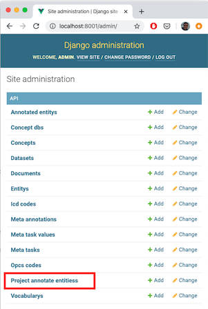

2\. 'Add Project Annotate Entities'

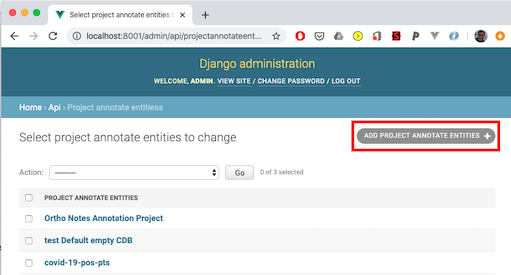
project_admin
3\. Complete the new annotation project form. The table below provides details the purpose of each field:

|Parameter|Description|
|---------|-----------|
|Name|# Name of the project that appears on the landing page|
|Description| Example projects', # Description as it appears on the landing page|
|Annotation guideline link|A link to a GoogleDoc, MS Sharepoint document etc. that provides this projects annotation guidelines|
|Members    | **list** of users that have access to this project, select the '+' to create new users |
|Dataset    | The set of documents to be annotated. The dataset tabular schema is described below.  |
|Validated Documents| Ignore this list. Use of this list is described in the forthcoming advanced administrator user guide|
|Cuis       | (Optional) A list of comma separated Concept Unique Identifiers (CUIs). Use this to only show precise concepts in this project |
|CUI File   | (Optional) A JSON formatted list of CUIs. Can be useful if the project should be setup to annotate large CUI lists extracted gathered from introspection of a CDB. **Will be merged with the above 'Cuis' list**| 
|Concept DB | A MedCAT Concept Database. This should be the resulting file from a call to the function medcat.cdb.CDB.save_dict('name_of_cdb.dat'). Clicking the '+' icon here opens a dialog to upload a CDB file. |
|vocab      | A MedCAT Vocabulary. This should be the resulting file from a call to the function medcat.cdb.utils.Vocab.save_dict('name_of_vocab.dat'). Clicking the '+' icon here opens a dialog to upload a vocab file.|
|cdb_search_filter|CDB ID used to lookup concepts during addition of annotations to a document|
|Require Entity Validation| (Default: True) With this option ticked, annotations in the interface, that are made by MedCAT will appear 'grey' indicating they have not been validated. Document submission is dependent upon all 'grey' annotations to be marked by a user. Unticked ensures all annotations are marked 'valid' by default|
|Train Model On Submit| (Default: True) With this option ticked, each document submission trains the configured MedCAT instance with the marked, and added if any, annotations from this document. Unticked, ensures the MedCAT model does not train between submissions.| 
|Add New Entities|(Default: False) With this option ticked, allows users to add entirely new concepts to the existing MedCAT CDB. False ensures this option is not available to users.|
|Restrict Concept Lookup|(Default: False) With this option ticked, restricts the concept lookup (add annotation / alternative concept) to only include those CUIs listed in the above filters (either from CUI / TUI list or uploade 'CUI File' list|
|Terminate Available|(Default: True) With this option ticked, the option to terminate an annotated concept will appear|
|Irrelevant Available|(Default: False) With this option ticked, the option to mark an annotated concept as 'irrlevant' will appear|
|Enable entity annotation comments|(Default: False) With this option ticked, the option to leave a comment for each annotation will appear|
|Tasks| Select from the list 'Meta Annotation' tasks that will appear once a given annotation has been marked correct.|
|Relations|Select from the list of 'Relation Annotation' tasks that will appear for a given concept.| 

Datasets can be uploaded in CSV or XLSX format. Example:

| name  | text                   | 
|-------|------------------------|
| Doc 1 | Example document text  |
| Doc 2 | More example text      |

The **name** column should be the ID (identifier) and unique for that dataset, the **text** column is the text to be annotated. 
Example datasets are supplied under docs/example_data/*.csv

4\. Click 'Save' to store the new project.

### Project Home Screen

Navigate to the home screen (`http://localhost:8001/` or `http://<hostname>:<port>/` depending on your deployment), login with your username and password setup previously.

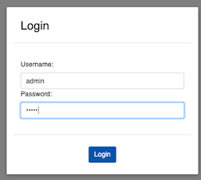

Select your new project to begin annotating documents

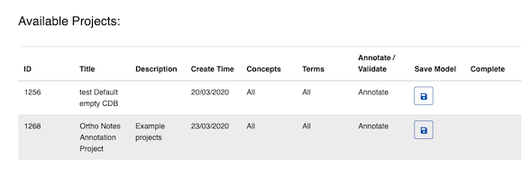

#### Admin Options
Admin users have extra options on the home screen:

1. Concepts Imported - specifies if this projects configured CDB Search Filter has been indexed. This is described in detail below.
2. Model Loaded - MedCAT models are loaded into memory (a python dict) once a project is loaded. Loading many models with larger trainer deployments can occupy a lot of memory. **Note** Clearing cached models may affect other projects using the same model instance.
3. Save Model - Write the in memory model to disk - to save the current in memory model state. This option is generally not advised as full model training should be done outside the trainer instance ideally. 

### Notes
- Example Concept and Vocab databses are freely available on MedCAT [github](https://github.com/CogStack/MedCAT).
Note. UMLS and SNOMED-CT are licensed products so only these smaller trained concept / vocab databases are made available currently.
- More documentation on the creation of UMLS / SNOMED-CT CDBs from respective source data will be released soon.
- Tasks allow for the creation of meta-annotations and their associated set of values an annotator can use.
An example 'meta-annotation' could be 'Temporality'. Values could then be 'Past', 'Present', 'Future'.
- Please NOTE Firefox and IE are currently not supported**. Please use Chrome or Safari.

## Concept Picker - CDB Concept Import
The concept picker is used to:
- Pick alternative concepts for an existing recognised span
  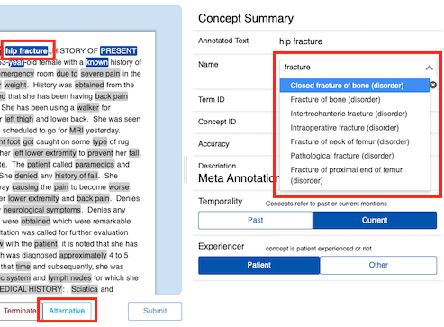
- Pick a concept during the 'Add Term' process.
  

The available list of concepts is populated via a MedCAT CDB and indexed in a [solr](https://solr.apache.org/) search index to enable fast type-ahead style search.

SNOMED-CT / UMLS built databases can contain thousands if not millions of concepts so this process is executed
in asynchronous task to ensure the admin page and app are still available for use.

**This process should only be done once for each concept universe (i.e. SNOMED-CT, UMLS are 2 distinct concept universes)**
per deployment or if the underlying MedCAT CDB changes Concepts will be indexed by there CUI, so importing different
CDB instances that reference the same concept universe will only import
the concepts that are in the set difference.

To make these concepts available to a (or any project):

1\. Open the admin app. (http://localhost:8001/admin/)

2\. Select 'Concept Dbs'
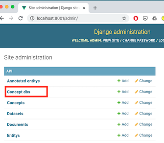

3\. Select the Concept DB entry, and choose the action 'Import concepts', then press the 'Go' button.
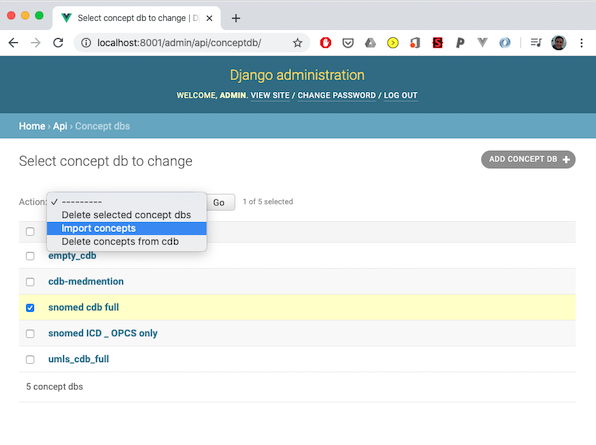

Once the concept imports are complete the solr search services will contain 'collections' that are used by a Django view
for fast type ahead searching. If you're an admin the project home screen will show if a project has had the selected 
'CDB Search Filter' imported into solr.
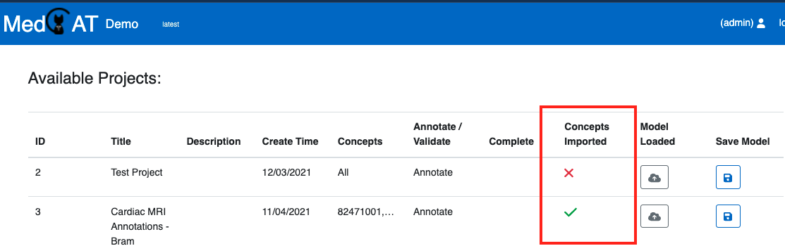

The Solr admin interface is available on the default port 8983. User guide [here](https://solr.apache.org/guide/solr/latest/getting-started/solr-admin-ui.html)

### Concept Collection Maintenance
The solr search service is designed to index all concepts and their metadata across any number of MedCAT Concept Databases. 
By default it is run on the same host as the MedCATtrainer django backend, making it fast to tear down, and upload concept 
collections, even if the entirety of SNOMED CT or UMLS is indexed. 

To update an index, first delete the outdated concepts from solr via the django admin panel:
1\. Open the admin app. (http://localhost:8001/admin/)

2\. Select 'Concept Dbs'

3\. Select the Concept DB entry, and choose the action 'Delete ', then press the 'Go' button.
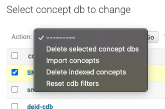

This will drop the corresponding collection in the solr search service. This can be also be performed in the solr admin UI by default port 8983.

## Downloading Annotations
Project annotations can be downloaded with or without the source text, especially important if the source text is
particularly sensitive and should be not be shared.

1\. Open the admin app. (http://localhost:8001/admin/)

2\. Select 'Project annotate entities',

3\. Select the project(s) to download the annotations for and select the appropriate action for w/ or w/o source text,
then press the 'Go' button. This will download all annotations, the meta-annotations (if any) for all projects selected.
Annotations

4\. An example jupyter notebook is provided under docs/Processing_Annotations.ipynb.

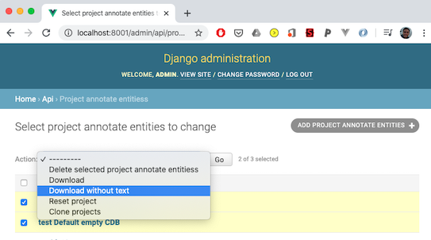

## Clone Project
Cloning Projects is a easy & fast method to create copies of configured projects. This includes the dataset, CDB / vocab
reference, meta annotation settings etc. Annotations themselves will not be copied across.

1\. Open the admin app. (http://localhost:8001/admin/), and select 'Project annotate entities' (same as above for downloading)

2\. Select the project(s) to clone, select the 'Clone projects', then press the 'Go' button.
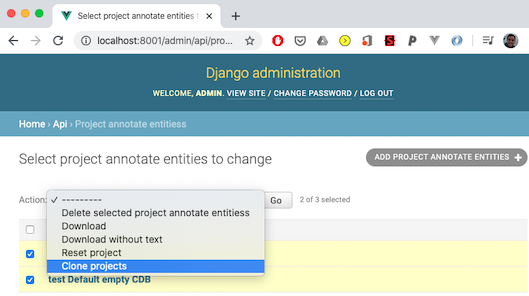

NB: Cloning projects will use the same CDB instance. If you're double annotating datasets to then calculate agreement scores (IIA, Cohen's Kappa etc.)
then uncheck "Train Model On Submit" for each of the projects to ensure the model is not trained by each annotator.
If you do want 'online training' of the model, use separate instances of the same model. You can directly upload multiple
instances of the same CDB file appropriately named to achieve this.

## Reset Project
**Use with caution. Resetting projects deletes all annotations and resets a project to its state upon initial creation.**

1\. Open the admin app. (http://localhost:8001/admin/), and select 'Project annotate entities'
(same as above for downloading)

2\. Select the project(s) to reset, then press the 'Go' button.
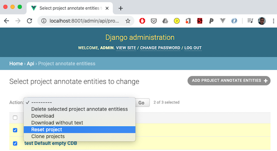

## Save Models
We strongly suggest models are not saved within MedCATtrainer then directly used. Instead, we suggest you use the collected
annotations from projects to train and test a new MedCAT model.

However, to save the current state of the model you can use:

An API call - \<deployment\>:\<port\>/save-models/<project-id> that can be used to save the current state of
a model. This will overwrite the current CDB file.

Alternatively, login with an 'admin', (i.e. staff or superuser) account and hit the save model button associated with the project.

## Download Models

1\. Open the admin app. (http://localhost:8001/admin/), and select 'Concept dbs'.

2\. Click the CDB item you would like to download.

4\. Click the CDB file, you will be prompted to save down the new CDB file. This file will be of the same format you
have used previously, i.e. you've called medcat.cdb.save_dict('<location>').

The saved MedCAT models can be used in any instance a regular MedCAT model may be used. I.e. in a jupyter notebook,
part of a web service, or further fine-tuning in another MedCATTrainer instance.

The Trainer currently does not support inspection / training / storage of the meta annotation models. These will be
integrated in a forthcoming release.

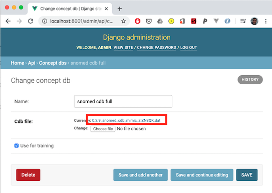

5\. To load the new dictionary use medcat.cdb.load_dict('<location>')

## Annotation Guidelines
Annotation guidelines can assist guiding annotators when annotating texts for a MedCATTrainer project.

Example Guidelines can be found [here](https://docs.google.com/document/d/1xxelBOYbyVzJ7vLlztP2q1Kw9F5Vr1pRwblgrXPS7QM/edit?usp=sharing).

An initial guideline can be refined using specific examples from your dataset in a pilot project containing a handful of documents.
