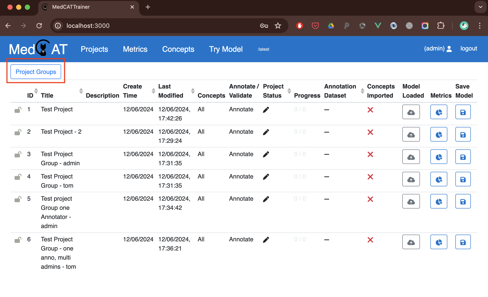
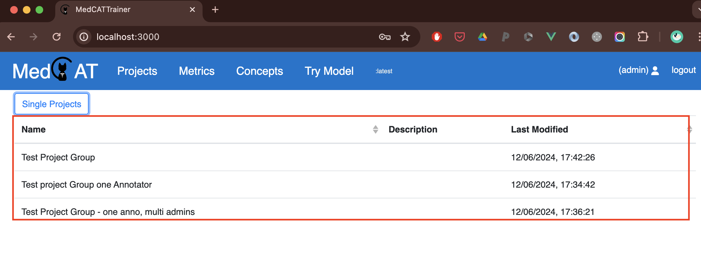
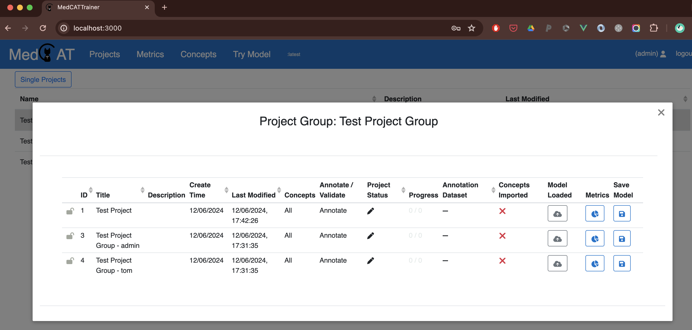

# Annotation Project Group Creation
Annotation projects often involve more than one annotator.

Project Group instances allow the creation and management of a group of annotation projects from one screen.

## Annotation Project Group Creation

Creating a Project Group is similar to regular [Annotation Project Creation](project_admin.md), but differs in a few 
key ways. 

They can be used to group existing projects together, or to create a set of Annotation Projects.

## Key Differences from Regular Project Creation

When completing a Project Group form, **Create Associated Projects** is a key parameter:

### Create Associated Projects: True
If checked will create an Annotation Project for each Annotator selected in the list. All selected Admins will be included as 'annotators' on each Project created. This saves 
the current steps of creating a 'template' projec then cloning, renaming and re-permissioning each project which happens with
regular project creation for multiple annotators. Each Project will be called **<Project Group Name> - <Annotator Name>**.

### Create Associated Projects: False
If False the only important parameters will be ProjectGroup Name and description. All other parameters will be ignored. The expectation here is 
that the projects that are to be grouped already exist, and each Project will be added to the new Project Group manually.

## Best Practise
Project Groups provide a convenience method for the creating managing grorups of Annotation Projects. Changes such as CUI filters, and projec settings changed once
in the group will flow down into the associated Annotation Projects.

## Using Annotation Project Groups
Regular, non-admin Users of MedCATTrainer, i.e. regular annotators, will not see the option to view Project Groups. 

Admin users will see an action bar as shown:

Selecting this view will show all available Project Groups to the logged in user.

Selecting a group now opens a lightbox with the list of projects in this group:

## Other Benefits of Project Groups

Further enhancements will allow metric further comparisson between projects in a group, gamification, standard annotation metric reporting (e.g. IIA / Cohen's Kappa statistics etc.)

